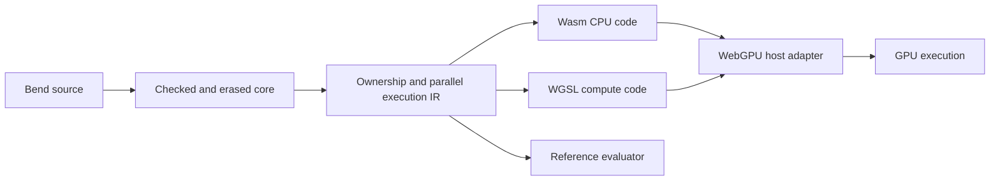

# Knot: Wasm with a WebGPU companion

Status: design recorded 2026-09-26. The user selected Wasm and adaptive
continuation tasks, and requires GPU execution. WebGPU/WGSL is the working
implementation direction for that requirement. The first bounded
[task/device probe](../research/adaptive-tasks/README.md) passes on Metal. Knot's
[first enum compiler and Node Wasm host](../research/compiler-wasm/README.md)
now execute generated programs. The self-built Wasm compiler and source-to-device
gate remain unimplemented.

## Execution boundary

Knot is written in Bend 2. Its planned self-built compiler will run as a Wasm
module; the current compiler is built by the pinned seed for native/Bun execution.
Generated enum programs already target Wasm. Planned GPU computations become separate WGSL
compute programs submitted through a WebGPU host adapter. Choosing Wasm alone
does not provide GPU execution.

The runtime remains ours to design: value representation, closures, allocation,
sharing/drop, continuations, work queues, effects, and resource limits. Keep
these explicit in our IR before separate Wasm and WGSL lowering. A reference
evaluator checks semantic preservation without depending on either backend.

Browser bindings already connect Wasm programs to the WebGPU JavaScript API
([Emdawnwebgpu][bindings]). A native host can expose corresponding imports
through an implementation such as [Dawn][dawn], which has Metal, Vulkan, and
D3D12 backends. The first probe uses Dawn's native Node binding on Metal; Wasm
imports and browser hosting are untested. The production engine, capability
profile, feature limits, and adapter ABI remain open.

## Working artifact and host contract

For a program with GPU computation, propose a bundle containing:

- A Wasm module with versioned imports/exports and declared feature requirements.
- WGSL modules plus entry-point, binding, and buffer-layout descriptions.
- A manifest of capabilities, resource budgets, and artifact identities.
- Source-origin information for diagnostics and runtime faults.

A CPU-only program, including the initial compiler, needs no GPU shader merely
to launch. A program requiring GPU execution must report unavailable capability
explicitly; silently running on CPU cannot satisfy the GPU acceptance gate.

Keep the host narrow: source/dependency bytes in, artifact/diagnostic bytes out,
plus explicit device operations for generated GPU programs. The host can load
and compile WGSL through WebGPU; it must not secretly parse, check, or compile
Bend for the self-built compiler. Host I/O remains outside pure GPU computation.

Do not equate Wasm linear memory with GPU storage buffers. Define layouts,
buffer ownership, upload/download, completion, and reclamation explicitly. Keep
data resident on the device across suitable work where possible; measure all
copying and synchronization. Cancellation must wait for safe resource reuse.

## Bend-specific work required for WGSL

WGSL [disallows recursive calls][functions]. Bend recursion therefore needs
lowering to loops and explicit continuation/work records rather than a direct
translation of recursive source functions. Closures need an explicit code-tag
and environment representation. Owned values need device-valid storage layouts.

The first prototype uses preallocated non-reused task slots and a bounded frontier.
Run scheduling phases through defined dispatch boundaries; do not assume a
global barrier or guaranteed progress of all workgroups inside one dispatch.
Specify overflow/exhaustion and supported primitive semantics before extending
the profile. The tree-task probe supplies finite evidence for these techniques;
general heap behavior and source semantics remain unverified.

Campaign decision D5 selects **instruction records plus a device interpreter
first**. Specialized WGSL emission is a later optimization over the same observed
semantics. Both require ownership, continuation, scheduling and allocation
contracts; neither a handwritten shader nor shader validation establishes
compiler-generated device execution.

The [selected execution model](EXECUTION-MODEL-CASE.md) is adaptive continuation
tasks over a strict affine continuation machine. The planned compiler execution
uses sequential Wasm; the device probe exchanges bounded work between
dispatches. It fixes a provisional 64-byte task layout for its tree fixtures
only. Production policies and layouts remain open. The
[law set](EXECUTION-MODEL-LAWS.md) separates ownership from memory publication;
the checked binary-join model is sequential and provides no device-memory proof.
D5 now fixes the first implementation strategy without changing that execution model.

## Bootstrap and first gates

1. The first enum increment pins Bend 2.0.29, scalar Wasm version 1 and Node
   22.22.3. It needs no memory or imports. Fields will require an explicit memory
   and ownership contract; adding GC, threads or SIMD needs a capability decision.
2. The enum slice emits valid Wasm, instantiates in the declared host and agrees
   with an independent evaluator. Finish S1 by adding fields, structural recursion
   and their allocation/drop semantics; the current slice does not establish them.
3. During S1-S2, test a narrow shared-IR fork/join tree on real WebGPU hardware.
   Include owned constructors, continuations, allocation/drop, and repeated runs;
   add closure captures with S2. Record device and dispatch evidence. A manually
   supplied IR fixture establishes feasibility, not Bend-source compilation.
4. After S3 supports the relevant syntax, compile a Bend fixture to the Wasm/WGSL
   bundle and run its GPU path. Check unsupported-capability and exhaustion paths.
5. At S4, the seed-built compiler emits the Wasm compiler; that compiler emits the
   next generation. Compare fixed artifacts and independent conformance results.
   Require the self-built compiler to emit and run the GPU fixture as a separate
   gate before claiming the combined self-hosting/GPU objective.

The first emitter writes Wasm binary directly in Bend, using the published
checked byte builder. `wasm2wat` only decodes artifacts for inspection; no
assembler or LLVM backend participates in emission. Future external backends
must remain visible in bootstrap receipts and the reproducibility contract.

This plan refines [the subset stages](BEND-SUBSET-STAGES.md); it does not expand
the compiler's own executed feature profile to include GPU offload or arrays.

[bindings]: https://dawn.googlesource.com/dawn/+/refs/heads/main/src/emdawnwebgpu/pkg/README.md
[dawn]: https://github.com/google/dawn
[functions]: https://www.w3.org/TR/WGSL/#restrictions-on-functions

## Device record contract: `knot-device-records-1`

Defined by the gpu-runtime campaign increment. This is a **bounded compiler/runtime
interface candidate**, implemented by a handwritten record interpreter in
[`gpu/runtime.wgsl`](../research/adaptive-tasks/gpu/runtime.wgsl). It is not a
production heap or a compiler output claim. The existing 38-case tree probe keeps
its separate `DEVICE-PROTOCOL.md` layout; those bytes are not version-1 records.

Current evidence: 16 literal-controlled cases, 62 commands and 186 phase
observations agree between the seed Bun/native models; seven Bend semantic mutants
are killed. The executor sandbox had no adapter, so it validated ten shader
variants (the implementation plus nine mutants) as 30 pipelines on Dawn's null
backend. The coordinator then ran the same commands on the host's Metal adapter
(Apple M5 Max, `metal-3`, not a fallback): all 16 device cases pass, all nine
WGSL semantic mutants are killed, and the older 38-case probe agrees before and
after the change. See [runtime evidence](../research/adaptive-tasks/runtime/README.md).
This qualifies the bounded probe domain only; compiler emission of these records
is not implemented.

### Words, bounds and identity

Every field is an aligned 32-bit unsigned word, serialized little-endian. No
host pointer, closure address, native struct padding or function pointer crosses
the boundary. A compiler-bundle host must validate version, profile, lengths, offsets,
reserved words and instruction set before upload. The current probe encodes
trusted fixtures; a general external bundle decoder is not implemented. Unknown version, profile or
opcode is `Unsupported`; malformed supported operands are `Invalid`. Count,
stride and offset arithmetic must be checked before indexing or allocating;
wrapping a byte address is never allowed. Version 1's probe admits at most two
records and a frontier capacity of 0, 1 or 2, so every offset is statically
bounded. Widening this bound requires a checked size/layout algorithm and gates.

The qualification state buffer is exactly 36 words (144 bytes):

| Word offset | Field | Meaning |
| --- | --- | --- |
| 0 | version | 1 |
| 1 | profile | 4 = owning slots, 6 = frontier tasks |
| 2 | arena | Supplied realm ID; issuer/restore uniqueness is a caller premise |
| 3 | capacity | Owning slots or frontier entries, 0–2 |
| 4 | record count | Equals capacity for slots; 2 for frontier tasks |
| 5 | generation ceiling | Inclusive final generation, 0 or 1 in the forced-retirement fixtures |
| 6 | index count | Free-list length for slots; frontier length for tasks |
| 7–11 | reply | outcome, reason, reply0, reply1, reply2 |
| 12–15 | reserved | Zero |
| 16–31 | two records | Eight words per record; unused records remain canaries |
| 32–33 | index table | Ordered free IDs or frontier task IDs |
| 34–35 | guards | `0xdeadbeef`; all table words beyond capacity also retain this value |

Owning-slot record words are `(state, generation, payload, 0, 0, 0, 0, 0)`.
States are Free=0, Live=1 and Retired=2. The scalar payload is an owner serial in
this probe, not a general `Type` value. A locator is exactly three words
`(arena, slot, generation)`. Check arena and bounds before record access, reject
Retired, check generation, then require Live before extraction. A copied locator
cannot extract a consumed owner. Successful take/drop clears the payload and
increments generation only below the ceiling; otherwise it retires permanently.
Retired-generation bits are not a new identity. No counter wraps into an old
locator. Failed insertion preserves both the old record and the incoming serial.

Task record words are `(id, phase, pc, payload, destination, logical_slot,
code_base, code_words)`. Phase values are Ready=1, Queued=2, Running=3,
Suspended=4, Waiting=5, Done=6; 7 is an internal fault marker. In this version,
`id` equals the record index and task records themselves are not recycled.
`(code_base, pc)` is the defunctionalized continuation's code identity; the
retained payload and destination are its explicit scalar environment. Code bases
index an immutable U32 instruction buffer. PC is relative to that range.
A logical destination/slot never depends on a physical frontier position.

The probe does **not** give task records an owning capture array, shared Data
edges or a cancellation attempt identity. These require a new qualified layout
revision. R4's generation is storage freshness, not task-attempt freshness.

### Interpreter instructions

A host/runtime command is eight words (32 bytes): `(opcode, a, b, c, 0, 0, 0, 0)`.
Both operand interpretation and reply decoding are profile-specific.

| Profile / opcode | Operands | Operation |
| --- | --- | --- |
| Slots / 1 | slot, payload | Insert at a chosen slot; occupied/retired/bounds failures return incoming payload |
| Slots / 2 | arena, slot, generation | Take exactly once |
| Slots / 3 | arena, slot, generation | Logical drop exactly once; no user destructor semantics |
| Slots / 4 | payload | Allocate the first free ID; full returns the input owner |
| Frontier / 16 | task ID | Offer Ready/Suspended task to the queue; full preserves queue and owner |
| Frontier / 17 | quantum, reverse | Three-phase round; quantum and reverse are each 0 or 1 |
| Frontier / 18 | task ID | Wake a Waiting task; other states reject unchanged |
| Either / other | — | Unsupported; preserve records and index table |

The continuation instruction buffer has one word per instruction: Yield=0,
Wait=1, Return=2. Yield suspends, Wait requires explicit wake, Return completes
with the retained scalar result. Each advances PC once; a zero quantum only
suspends and keeps PC. A malformed range/PC is an internal invariant failure,
not an executable source result. Only these statically validated instruction
bundles are admitted; unknown program instructions are Unsupported at the bundle
boundary. Arithmetic, calls, constructors, general capture/drop, forks and
n-ary joins have no admitted instruction encoding yet. A future Knot emitter may
emit this bounded subset only; it must report other reachable operations as
Unsupported rather than reinterpret them or pass them through unchecked.

Outcome codes are Ok=0, Invalid=1, Unsupported=2, Exhausted=3, Rejected=4,
InternalFailure=5. HostFailure is outside device words (adapter, API, mapping or
submission failure). Rejected is a legal operation failure, not a judgment that
Bend source is invalid. Slot reasons are full=1, bounds=2, arena=3, stale=4,
vacant=5, occupied=6, retired=7; full/retired classify as Exhausted. Task reasons
are full=1, state=2, operands=3, opcode=4, bounds=5, invariant=6. Success replies
carry a locator for insertion/allocation, the serial for take/drop, or the ID for
offer/wake; round replies are zero. Unused reply words are zero. A rejected
insertion returns its input serial; rejected take/drop exposes no payload.

### Three-phase round and lifetime

The [independent Bend model](../research/adaptive-tasks/runtime/frontier.bend)
defines `round(c,s) = publish(c,execute(c,prepare(c,s)))`. Its quantified zero-slice
law preserves PC, payload and destination. Seven additional filled laws cover
unsupported-slot preservation and inhabited full/duplicate/reverse/suspend/wait/fault
controls. These are eight checked laws, not a general GPU refinement or memory-model proof.

1. **Prepare:** one scheduler invocation admits/offers work and compacts a
   published frontier. Reversal copies from the immutable prior frontier.
   Admitted tasks become Running; full offers preserve all prior records and the
   queue. There is no reservation counter authorizing an unread payload.
2. **Execute:** a separate dispatch reads the complete prepared snapshot and
   writes a distinct work buffer. Each task has one writer. The probe uses two
   invocations within a workgroup; it makes no multi-workgroup scalability claim.
   Task state and PC determine bounded progress. Destination and capture words
   cannot change with compaction.
3. **Publish:** a third dispatch copies the work snapshot into the next state,
   validates task faults and empties the consumed frontier. Old snapshot bytes
   are no longer execution authority. Each buffer swap follows completed
   submission/readback; destruction waits for `onSubmittedWorkDone`.

The implementation never reads another invocation's writes within a dispatch.
R4 reuse occurs between completed commands with no outstanding readers. General
reuse across suspended references, shared Data, cancellation or concurrent
readers is R7 and remains unqualified. Failure replies retain owner obligations;
physical bytes alone do not grant a second owner.

### Acceptance before compiler integration

The host may encode/decode records and dispatch; the independent semantic model
stays in Bend. Require model/device equality for every command and phase, guard
words, preserved owners, and nine type-valid WGSL semantic mutants killed on
hardware. The runner cannot count shader errors, host failures or the null
backend as mutation kills. Preserve the original 38-case semantic regression;
ignore its scheduling hashes/move counters, not its results or ownership checks.
Only then connect a Knot-emitted versioned bundle and compare seed, Knot evaluator,
Knot Wasm and device results for the newly supported source profile.

## Device record contract: `knot-device-records-2`

GPU increment `gpu-2` implements the D10 choice: unique Type objects and counted
immutable Data. It leaves version 1 and the 38-case tree probe unchanged. Version
2 has fresh CPU and null-backend shader evidence; **Metal qualification is still
required**. See the [runtime and receipts](../research/adaptive-tasks/runtime2/README.md).

The bundle has numeric `version=2`, `profile=2`, an explicit capacity/limit
configuration, and eight-u32 instruction records. All words are little-endian.
The [host validator](../research/adaptive-tasks/runtime2/bundle.py) rejects unknown
version/profile/opcode as Unsupported, malformed supported fields as Invalid,
and capacity/size overflow as Exhausted. It derives every count, stride and
offset by checking `count <= (limit-base)/stride` before multiplication/addition.
An optional supplied layout must match exactly; arbitrary restored state is not
accepted. Binding bytes are bounded by the adapter and the whole-word u32 address
ceiling. There is no two-record ceiling. Tests actually fill 1, 2, 64 and 4,096
objects and refuse one more; separate controls cover maximal layout arithmetic
without claiming those maximal buffers were allocated on a device.

| Record | Word layout / ownership |
|---|---|
| Header | 32 words: capacities, checked offsets/strides, limits, status/reply, pending length, identity issuer, reader count, free count, PC/phase. Exact offsets in `runtime2/layout.json`. |
| Object | Metadata `[identity,kind,rc,arity]`, then payload `[tag][live child identities]`; stride `5+maxArity`. RC is outside the payload. |
| Capture | One owning identity per slot; contiguous ranges form defunctionalized environments. Type moves clear the source; extra Data holders require checked retain. |
| Pending release | Persistent LIFO identities, each still an owning edge. Last release moves children here only after reserving the required work space. |
| Join | `[attempt,state,arity,received,completions,code,captureBase,captureCount][ordered results]`; stride `8+maxArity`. Attempt identity is separate from object identity. |

Each table ends with a checked guard word. Unused payload words remain zero.
Scalars are boxed as nullary tagged objects; all live fields in this version are
object identities. Object slots are reusable, but bundle-local identities are
never reissued. Exhausting the identity issuer or a join attempt counter cannot
wrap. These internal identities are not portable `(arena,slot,generation)`
locators; version 1's external-locator qualification remains separate.

One generic WGSL interpreter supplies execute, run and publish entry points.
One owning writer updates a work snapshot; a separate dispatch publishes it.
Instructions construct/share/move/open/release/clean captures, establish reader
barriers, start/deliver/cancel/resume ordered joins, inspect tags, and check spans.
The program driver adds branch/jump/halt/yield and an explicit quantum. Zero
quantum preserves PC and owners; resume jumps to a saved code index. Right-before-
left delivery retains logical order (7/9 gives the noncommutative observation
709); n-ary completion is counted once per attempt. Stale completions preserve
their rejected source owners. Cancellation reserves cleanup capacity before
consuming either saved captures or arrived results.

Shared Data opening preflights all acquired child edges, including repeated
identities, before publishing any count change. Cleanup retains its pending
stack on budget/storage exhaustion. Outstanding readers block physical opening
and reclamation; host buffer reuse/destruction waits for submitted work. This
serial barrier protocol is not evidence for simultaneous mutating workgroups.

The [exact compiler mapping](../research/adaptive-tasks/runtime2/INTERFACE.md)
specifies Case → branch/open, Application → captures/start/jump/deliver/resume,
Construct → checked object allocation, and Let → move/share/release. Compiler
emission, dynamic recursive activation allocation and attempt operand transport
remain next-increment obligations; no `src/` semantics changed. The record gate
compares independent Bend Bun/native and Python models, not source-generated
Knot Wasm. The next source capability still needs seed ⇔ Knot evaluator ⇔ Knot
Wasm ⇔ actual-device conformance.
