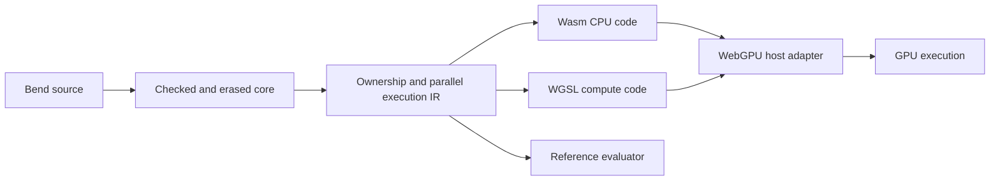

# Knot: Wasm with a WebGPU companion

Status: design recorded 2026-09-26. The user selected Wasm and adaptive
continuation tasks, and requires GPU execution. WebGPU/WGSL is the working
implementation direction for that requirement. The first bounded
[task/device probe](../research/adaptive-tasks/README.md) passes on Metal. Knot's
compiler, Wasm host, and source-to-device gate remain unimplemented.

## Execution boundary

Knot is written in Bend 2. Its self-built compiler runs as a Wasm module.
Generated CPU code also targets Wasm. GPU computations become separate WGSL
compute programs submitted through a WebGPU host adapter. Choosing Wasm alone
does not provide GPU execution.

The runtime remains ours to design: value representation, closures, allocation,
sharing/drop, continuations, work queues, effects, and resource limits. Keep
these explicit in our IR before separate Wasm and WGSL lowering. A reference
evaluator checks semantic preservation without depending on either backend.

Browser bindings already connect Wasm programs to the WebGPU JavaScript API
([Emdawnwebgpu][bindings]). A native host can expose corresponding imports
through an implementation such as [Dawn][dawn], which has Metal, Vulkan, and
D3D12 backends. The first probe uses Dawn's native Node binding on Metal; Wasm
imports and browser hosting are untested. The production engine, capability
profile, feature limits, and adapter ABI remain open.

## Working artifact and host contract

For a program with GPU computation, propose a bundle containing:

- A Wasm module with versioned imports/exports and declared feature requirements.
- WGSL modules plus entry-point, binding, and buffer-layout descriptions.
- A manifest of capabilities, resource budgets, and artifact identities.
- Source-origin information for diagnostics and runtime faults.

A CPU-only program, including the initial compiler, needs no GPU shader merely
to launch. A program requiring GPU execution must report unavailable capability
explicitly; silently running on CPU cannot satisfy the GPU acceptance gate.

Keep the host narrow: source/dependency bytes in, artifact/diagnostic bytes out,
plus explicit device operations for generated GPU programs. The host can load
and compile WGSL through WebGPU; it must not secretly parse, check, or compile
Bend for the self-built compiler. Host I/O remains outside pure GPU computation.

Do not equate Wasm linear memory with GPU storage buffers. Define layouts,
buffer ownership, upload/download, completion, and reclamation explicitly. Keep
data resident on the device across suitable work where possible; measure all
copying and synchronization. Cancellation must wait for safe resource reuse.

## Bend-specific work required for WGSL

WGSL [disallows recursive calls][functions]. Bend recursion therefore needs
lowering to loops and explicit continuation/work records rather than a direct
translation of recursive source functions. Closures need an explicit code-tag
and environment representation. Owned values need device-valid storage layouts.

The first prototype uses preallocated non-reused task slots and a bounded frontier.
Run scheduling phases through defined dispatch boundaries; do not assume a
global barrier or guaranteed progress of all workgroups inside one dispatch.
Specify overflow/exhaustion and supported primitive semantics before extending
the profile. The tree-task probe supplies finite evidence for these techniques;
general heap behavior and source semantics remain unverified.

Two implementation strategies remain to compare: generate specialized WGSL for
each program, or execute our own instruction records in a WGSL interpreter.
Both require a real device scheduler and allocator. Neither removes the need to
validate ownership, continuation handling, and useful work distribution.

The [selected execution model](EXECUTION-MODEL-CASE.md) is adaptive continuation
tasks over a strict affine continuation machine. The planned compiler execution
uses sequential Wasm; the device probe exchanges bounded work between
dispatches. It fixes a provisional 64-byte task layout for its tree fixtures
only. Production policies and layouts remain open. The
[law set](EXECUTION-MODEL-LAWS.md) separates ownership from memory publication;
the checked binary-join model is sequential and provides no device-memory proof.
The two code-generation choices above remain independent of this model choice.

## Bootstrap and first gates

1. Pin the upstream Bend seed, Wasm feature profile/runner, and host ABI. The
   proposed starting profile is scalar Wasm32 with linear memory; adding GC,
   threads, SIMD, or another feature requires an explicit capability decision.
2. Finish S1 with a small supported Bend program that emits a valid Wasm module,
   instantiates in the declared host, and agrees with the reference evaluator.
3. During S1-S2, test a narrow shared-IR fork/join tree on real WebGPU hardware.
   Include owned constructors, continuations, allocation/drop, and repeated runs;
   add closure captures with S2. Record device and dispatch evidence. A manually
   supplied IR fixture establishes feasibility, not Bend-source compilation.
4. After S3 supports the relevant syntax, compile a Bend fixture to the Wasm/WGSL
   bundle and run its GPU path. Check unsupported-capability and exhaustion paths.
5. At S4, the seed-built compiler emits the Wasm compiler; that compiler emits the
   next generation. Compare fixed artifacts and independent conformance results.
   Require the self-built compiler to emit and run the GPU fixture as a separate
   gate before claiming the combined self-hosting/GPU objective.

Whether the first emitter writes Wasm binary directly or uses a pinned text
assembler remains an implementation choice. LLVM could also emit Wasm, but is
not implied by choosing the Wasm target. Any external assembler/backend stays
visible in bootstrap receipts and the reproducibility contract.

This plan refines [the subset stages](BEND-SUBSET-STAGES.md); it does not expand
the compiler's own executed feature profile to include GPU offload or arrays.

[bindings]: https://dawn.googlesource.com/dawn/+/refs/heads/main/src/emdawnwebgpu/pkg/README.md
[dawn]: https://github.com/google/dawn
[functions]: https://www.w3.org/TR/WGSL/#restrictions-on-functions
