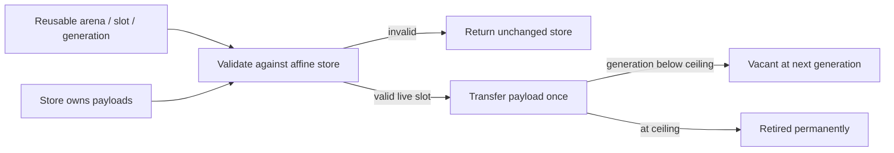

# Bounded owning store qualification

Verified seed CPU component for structural runtime work: generic affine payloads,
checked indexed insertion, allocation, transfer, release, generation rejection
and permanent retirement. The [contract](SPEC.md) and [law review](LAW_REVIEW.md)
define the boundary. Nothing here changes Knot's accepted language or emits a
Wasm/GPU store.

```sh
python3 research/owned-store/check.py
bun research/owned-store/trust.ts
```

The first command builds the Bend implementation and an independent Bend list
model with the pinned 2.0.29 seed. Native and Bun each agree on 3,532 traces:
3,510 exhaustive short sequences, fifteen literal witnesses and seven larger
capacities through 4096. Results include all returned payload serials, metadata,
free-list order, vacant/retired cells and live contents. Four additional backend
observations cover U32.max-1/max generation. Six type-correct semantic mutants
are rejected. Five quantity fixtures distinguish reusable locators from affine
stores/payloads. [Exact commands and outcomes](receipts/gate.json) retain evidence.

Fourteen filled equations pass with zero holes. They cover generic cell ownership
and disposer behavior, plus singleton/public and word-boundary normalizations.
They do not prove the complete array implementation refines the list model for
all traces. [Trust inventory](receipts/trust.json) records the pinned seed, loaded
Base foreign/unsafe declarations and the generated IO.print capability. No new
unsafe declaration or host implementation of store semantics was introduced.

The mechanism is a synchronous affine transaction:



[store.bend](store.bend) owns cells in a balanced Array and validates logical
bounds before masked Array helpers. Allocation uses an explicit free-list head;
explicit put removes its ID from that bounded list. Successful take restores a
vacant/retired cell before returning the successor store. Failed insertion
returns both the old store and the incoming owner. [model.bend](model.bend) uses
persistent Data lists; [observe.bend](observe.bend) consumes actual Type payloads
to produce [protocol](protocol.bend) observations. Snapshots do not clone owners.

Source inspection gives logarithmic balanced-array access; explicit put also
walks the free list. Initialization and snapshots are linear in capacity. The
backend runs demonstrate completion through 4096, not an empirical complexity
bound or a speedup. The first giant test-input literal hit Bun's construction
stack; the retained [failed attempt](receipts/attempt-001.json.gz) is distinct from
the passing 32-case batching harness. No assertion was weakened.

[Semantic and style review](PERCH_REPORT.md) has nonzero current coverage.
The three-axis style bar remains unmet and is recorded as attention.

Next: map the same ownership transitions to checked flat Wasm/GPU records,
qualify compact live-field layouts and handle-word encoding, and establish the
arena-ID lifetime/restore contract. Shared Data lifetime, suspended/partial-join
roots and reclamation require separate probes. Store constructors are trusted
internal construction; type-checked clients can still forge them, so the eventual
runtime must enforce its construction boundary. No general allocator or Data
lifetime policy is selected by this component.
